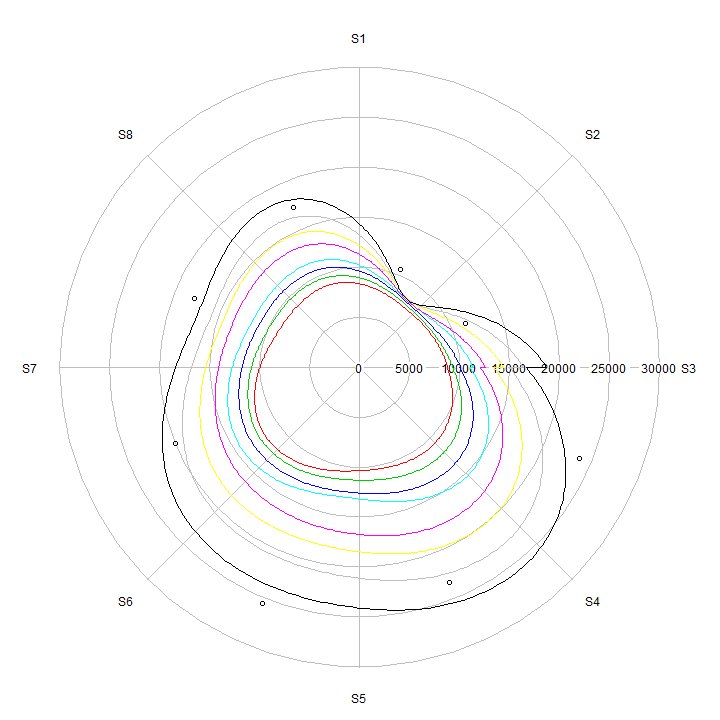

Estidio de variables para analisis de aptitud: inclinación del terreno
========================================================

### 1) Cargar datos fuentes y representar su resumen


```r
library(lattice)
library(foreign)

as.numeric.factor <- function(x) {as.numeric(levels(x))[x]}

my_path <- "C:\\temp"
my_filename <- 'muestreoPendMDE10k1.dbf'
#my_breaks <- c(0,0.5,1,1.5,2,2.5,3,3.5,4,4.5,5,10,20,30,40,50,90)
my_breaks <- c(0,5,10,15,20,25,30,35,40,45,50,55,60,65,70,75,80,90)


my_data <- read.dbf(file.path(my_path, my_filename))

my_data[,"L2015_city"] <- as.factor(my_data[,"L2015_city"])

dim(my_data)
```

```
## [1] 10000     7
```

```r
summary(my_data)
```

```
##    puntosAlea         X                Y           L2015_city
##  Min.   :   0   Min.   :640952   Min.   :2249250   0:7100    
##  1st Qu.:2500   1st Qu.:655862   1st Qu.:2265273   1:2900    
##  Median :5000   Median :670076   Median :2281049             
##  Mean   :5000   Mean   :670050   Mean   :2281028             
##  3rd Qu.:7499   3rd Qu.:684269   3rd Qu.:2296900             
##  Max.   :9999   Max.   :698952   Max.   :2312391             
##    L2015_uso_       MDEJal15m3     PendGradAG    
##  Min.   :0.0000   Min.   : 778   Min.   : 0.000  
##  1st Qu.:0.0000   1st Qu.:1516   1st Qu.: 1.522  
##  Median :0.0000   Median :1578   Median : 3.466  
##  Mean   :0.7372   Mean   :1597   Mean   : 7.535  
##  3rd Qu.:0.0000   3rd Qu.:1668   3rd Qu.:10.015  
##  Max.   :8.0000   Max.   :2836   Max.   :70.222
```


### 2) Relación entre valores de pendiente y presencia de urbanización (diagrama de caja)
### a) "city footprint"; b) clases


```r
par(mfcol = c(1, 2), cex = 0.9)

B0 <- boxplot(my_data[,"PendGradAG"] ~ my_data[,"L2015_city"],
              col=c('lightblue','yellow'), 
              names=c('No','Si'),
              xlab="urbanizacion (city footprint)", ylab="pendiente (°)"
              )

B1 <- boxplot(my_data[,"PendGradAG"] ~ my_data[,"L2015_uso_"],
              col=c('lightblue','yellow','lightgray','lightgreen',
                    'pink','green','orange','blue','darkblue'), 
              names=c('Abierto','M1','M2','M3','Inf','AV1','AV2','Agua1','Agua2'), las = 2,
              xlab="urbanizacion (clases)", ylab="pendiente (°)"
              )
```

 


### 3) Histogramas de distribución de los valores de pendiente en grados


```r
H0 <- hist(my_data[,"PendGradAG"], prob=FALSE, 
          col="grey", main='valores de pendiente', breaks=my_breaks, 
          xlab="pendiente (°)", ylab="número de observaciones") 
```

```
## Warning in plot.histogram(r, freq = freq1, col = col, border = border,
## angle = angle, : the AREAS in the plot are wrong -- rather use 'freq =
## FALSE'
```

 


```r
par(mfcol = c(1, 2), cex = 0.9)

H1 <- hist(my_data[my_data[["L2015_city"]] == '1',"PendGradAG"],prob=FALSE, 
          col="yellow", 
          main='pendiente (city footprint)', 
          breaks=my_breaks, 
          xlab="pendiente (°)", ylab="número de observaciones")
```

```
## Warning in plot.histogram(r, freq = freq1, col = col, border = border,
## angle = angle, : the AREAS in the plot are wrong -- rather use 'freq =
## FALSE'
```

```r
H2 <- hist(my_data[my_data[["L2015_city"]] == '1',"PendGradAG"],prob=TRUE, 
          col="yellow", 
          main='pendiente (city footprint)', 
          breaks=my_breaks, ylim=c(0,0.22),
          xlab="pendiente (°)", ylab="densidad de probabilidad")

H2 <- lines(density(my_data[my_data[["L2015_city"]] == '1',"PendGradAG"],adjust=2),
            col="blue", lwd=1)
```

 

```r
H2_density <- density(my_data[my_data[["L2015_city"]] == '1',"PendGradAG"],adjust=2, from=0, to=30, n=2048)

my_x <- seq(from = 0, to = 5.5, by = 0.1)
my_predict <- approx(H2_density$x,H2_density$y,xout = my_x)

plot(H2_density, col="blue", main='función de densidad')
plot(my_predict, col="red", main='predicción de valores')
```

 


### 4) Analisis por medio de regresión logistica (city footprint)


```r
P0_x <- my_data[,"PendGradAG"]
P0_y <- as.numeric.factor(my_data[,"L2015_city"])

P0_fit <- glm(P0_y ~ P0_x,
               family=binomial(logit))

summary(P0_fit)
```

```
## 
## Call:
## glm(formula = P0_y ~ P0_x, family = binomial(logit))
## 
## Deviance Residuals: 
##     Min       1Q   Median       3Q      Max  
## -1.1460  -0.9573  -0.5054   1.2091   3.7912  
## 
## Coefficients:
##              Estimate Std. Error z value Pr(>|z|)    
## (Intercept) -0.074262   0.031150  -2.384   0.0171 *  
## P0_x        -0.166968   0.006091 -27.414   <2e-16 ***
## ---
## Signif. codes:  0 '***' 0.001 '**' 0.01 '*' 0.05 '.' 0.1 ' ' 1
## 
## (Dispersion parameter for binomial family taken to be 1)
## 
##     Null deviance: 12043  on 9999  degrees of freedom
## Residual deviance: 10496  on 9998  degrees of freedom
## AIC: 10500
## 
## Number of Fisher Scoring iterations: 6
```

```r
P0 <- xyplot(P0_y ~ P0_x, 
         panel = function(x, y) {
              panel.xyplot(x, y, col="blue")
              panel.curve(predict(P0_fit,data.frame(P0_x=x),type="response"),0,90, col="red")
              panel.curve(predict(P0_fit,data.frame(P0_x=x),type="response")/
                          predict(P0_fit,data.frame(P0_x=0),type="response"),0,90, col="darkgreen")

          }, 
          main='urbanización vs. pendiente', 
          ylab="urbanización (city footprint)", xlab="pendiente (°)",
          key=list(space="top", x=10,y=10,corner=c(0,1),
                 lines=list(col=c("red","darkgreen"), lwd=1),
                 text=list(c("Curva logistica","Curva logistica normalizada"))
              )          
)

P0
```

 

```r
#curve(predict(P0_fit, data.frame(Temperature=x), type="resp"), 
#      add=TRUE, col="red")

#lines(seq(0,90,0.1), predict(P0_fit), type="l", col="red")
```

### 5) Analisis por medio de regresión logistica (espacio construido)


```r
P1_x <- my_data[,"PendGradAG"]
P1_y <- as.numeric(my_data[,"L2015_uso_"])
P1_y_logical <- P1_y > 0 & P1_y < 5
P1_y <- P1_y_logical * 1

P1_fit <- glm(P1_y ~ P1_x,
               family=binomial(logit))

summary(P1_fit)
```

```
## 
## Call:
## glm(formula = P1_y ~ P1_x, family = binomial(logit))
## 
## Deviance Residuals: 
##     Min       1Q   Median       3Q      Max  
## -0.9074  -0.7583  -0.4996  -0.0810   4.2614  
## 
## Coefficients:
##              Estimate Std. Error z value Pr(>|z|)    
## (Intercept) -0.674706   0.035969  -18.76   <2e-16 ***
## P1_x        -0.197331   0.008829  -22.35   <2e-16 ***
## ---
## Signif. codes:  0 '***' 0.001 '**' 0.01 '*' 0.05 '.' 0.1 ' ' 1
## 
## (Dispersion parameter for binomial family taken to be 1)
## 
##     Null deviance: 9449.1  on 9999  degrees of freedom
## Residual deviance: 8321.2  on 9998  degrees of freedom
## AIC: 8325.2
## 
## Number of Fisher Scoring iterations: 6
```

```r
P1 <- xyplot(P1_y ~ P0_x, 
         panel = function(x, y) {
              panel.xyplot(x, y, col="blue")
              panel.curve(predict(P1_fit,data.frame(P1_x=x),type="response"),0,90, col="red")
              panel.curve(predict(P1_fit,data.frame(P1_x=x),type="response")/
                          predict(P1_fit,data.frame(P1_x=0),type="response"),0,90, col="darkgreen")

          }, 
          main='urbanización vs. pendiente', 
          ylab="urbanización (espacio construido)", xlab="pendiente (°)",
          key=list(space="top", x=10,y=10,corner=c(0,1),
                 lines=list(col=c("red","darkgreen"), lwd=1),
                 text=list(c("Curva logistica","Curva logistica normalizada"))
              )          
)

P1
```

 
