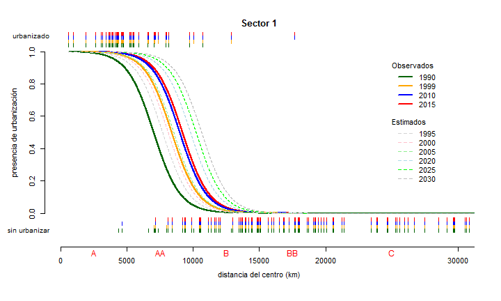
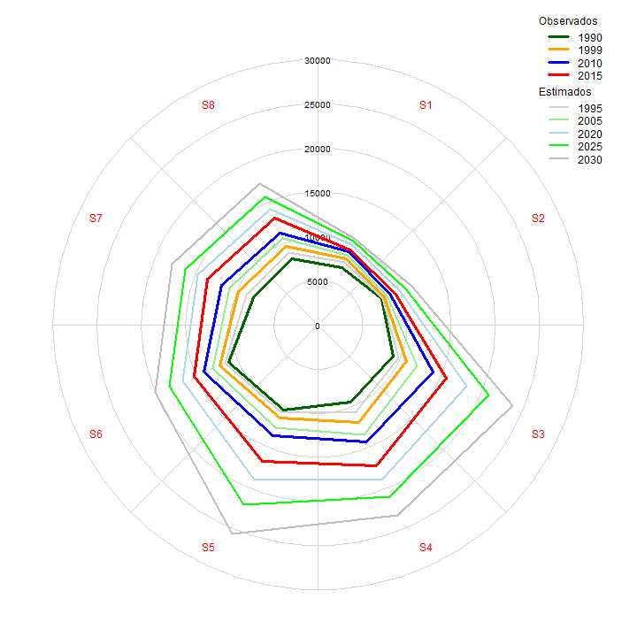

Estidio de variables para analisis de aptitud: inclinación del terreno para la tema de inundación
========================================================

### 1) Cargar datos fuentes y representar su resumen


```r
library(lattice)
library(foreign)

my_path <- "C:\\temp"
my_filename <- 'Sample_pend_incidencia_inundacion.dbf'

my_breaks <- c(0,5,10,15,20,25,30,35,40,45,50,55,60,65,70,75,80,90)


my_data <- read.dbf(file.path(my_path, my_filename))
dim(my_data)
```

```
## [1] 3878    4
```

```r
summary(my_data)
```

```
##    PUNTOS_DE_           X                Y             PENDGRADAG    
##  Min.   :   0.0   Min.   :     0   Min.   :      0   Min.   : 0.000  
##  1st Qu.: 969.2   1st Qu.:666485   1st Qu.:2280652   1st Qu.: 0.000  
##  Median :1938.5   Median :670755   Median :2284548   Median : 1.522  
##  Mean   :1938.5   Mean   :665469   Mean   :2278074   Mean   : 1.680  
##  3rd Qu.:2907.8   3rd Qu.:674369   3rd Qu.:2287632   3rd Qu.: 2.151  
##  Max.   :3877.0   Max.   :835631   Max.   :2502764   Max.   :29.242
```

```r
P1 <- boxplot(my_data[,"PENDGRADAG"], col="lightgray", ylab="pendiente (°)")
```

 

### 2) Analisis de la función de densidad de eventos de inundación en función de pendiente


```r
par(mfcol = c(1, 2), cex = 0.9)

H1 <- hist(my_data[,"PENDGRADAG"],prob=FALSE, 
          col="yellow", 
          main='pendiente (inundación)', 
          breaks=my_breaks, 
          xlab="pendiente (°)", ylab="número de iundaciones")
```

```
## Warning in plot.histogram(r, freq = freq1, col = col, border = border,
## angle = angle, : the AREAS in the plot are wrong -- rather use 'freq =
## FALSE'
```

```r
H2 <- hist(my_data[,"PENDGRADAG"],prob=TRUE, 
          col="yellow", 
          main='pendiente (inundación)', 
          breaks=my_breaks, ylim=c(0,0.22),
          xlab="pendiente (°)", ylab="densidad de probabilidad")

H2 <- lines(density(my_data[,"PENDGRADAG"],adjust=3),
            col="blue", lwd=1)
```

 

```r
H2_density <- density(my_data[,"PENDGRADAG"],adjust=3, from=0, to=90, n=2048)

my_x <- seq(from = 0, to = 5.5, by = 0.1)
my_predict <- approx(H2_density$x,H2_density$y,xout = my_x)

# my_predict_2 <- approx(H2_density$x,H2_density$y,xout = 5)$y
# my_predict_2

plot(H2_density, col="blue", main='función de densidad')
plot(my_predict, col="red", main='predicción de valores')
```

 


### 3) Recalculo de los valores de raster con la función de densidad


```r
library(raster)
```

```
## Warning: package 'raster' was built under R version 3.1.2
```

```
## Loading required package: sp
```

```
## Warning: package 'sp' was built under R version 3.1.2
```

```r
x_raster <- raster("C:\\temp\\INEGI_UTM13_a30_slope_mini.tif")
```

```
## rgdal: version: 0.9-1, (SVN revision 518)
## Geospatial Data Abstraction Library extensions to R successfully loaded
## Loaded GDAL runtime: GDAL 1.11.1, released 2014/09/24
## Path to GDAL shared files: C:/Users/Viacheslav/Documents/R/win-library/3.1/rgdal/gdal
## GDAL does not use iconv for recoding strings.
## Loaded PROJ.4 runtime: Rel. 4.8.0, 6 March 2012, [PJ_VERSION: 480]
## Path to PROJ.4 shared files: C:/Users/Viacheslav/Documents/R/win-library/3.1/rgdal/proj
```

```r
dim(x_raster)
```

```
## [1] 302 468   1
```

```r
plot(x_raster, main="MDE pendiente inicial")
```

 

```r
#r <- getValues(x_raster)
#length(r)
#r[1:100]
#for (i in 1:100 ) {
#      r[i]
#      interp <- approx(H2_density$x,H2_density$y,xout = r[i])
#      interp <- interp$y
#      print(interp)
#}

x_raster_mod <- calc(
    x_raster, 
    fun=function(x){ 
      x
      interp <- approx(H2_density$x,H2_density$y,xout = x)
      interp <- interp$y
      interp
      return(as.numeric(interp))
    } )

x_raster_mod = x_raster_mod / maxValue(x_raster_mod)       # normalizando con el valor máximo

x_raster_mod
```

```
## class       : RasterLayer 
## dimensions  : 302, 468, 141336  (nrow, ncol, ncell)
## resolution  : 29.16489, 29.16489  (x, y)
## extent      : 637130.1, 650779.2, 2300440, 2309248  (xmin, xmax, ymin, ymax)
## coord. ref. : +proj=utm +zone=13 +datum=WGS84 +units=m +no_defs +ellps=WGS84 +towgs84=0,0,0 
## data source : in memory
## names       : layer 
## values      : 0, 1  (min, max)
```

```r
plot(x_raster_mod, main="MDE pendiente modificado")
```

 

```r
if (require(rgdal)) {
  rf <- writeRaster(x_raster_mod, filename="C:\\temp\\INEGI_UTM13_a30_slope_mini_out.tif", format="GTiff", overwrite=TRUE)
}
```


