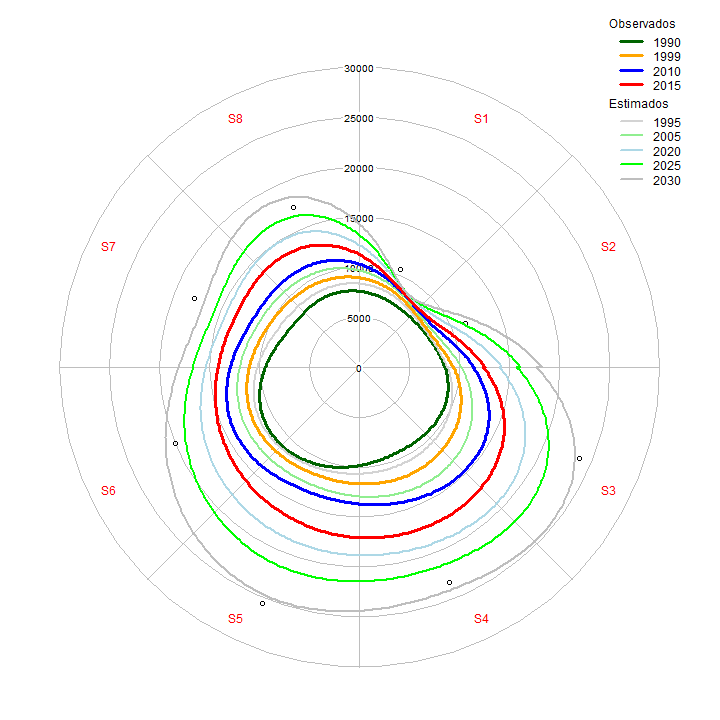
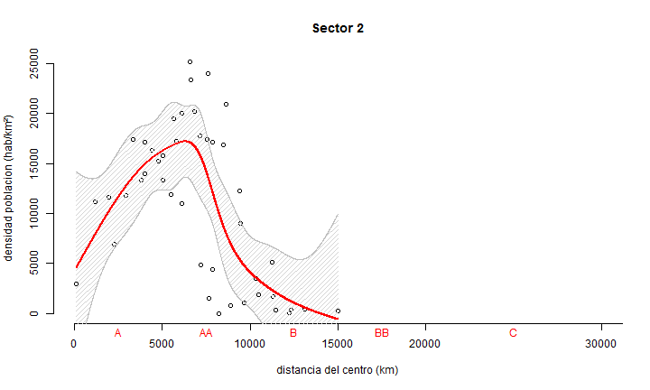

### Resultados de densidad de poblacion 


```r
library(lattice)
#library(foreign)

my_path <- "C:\\Users\\Viacheslav\\Google Drive\\Projects_actual\\geo_Urbanismo_IMEPLAN\\IMEPLAN_t4"
my_filename <- 'interCentHexSectores.csv'

my_breaks <- c(0,5000,10000,15000,20000,30000,40000,50000)
my_labels <- c("A","AA","B","BB","C","D","E")
my_labels_position <- c(2500,7500,12500,17500,25000,35000,45000)
my_df <- c(6,7,9,11,10,9,9,7)


my_data <- read.csv(file.path(my_path, my_filename))
dim(my_data)
```

```
## [1] 968   5
```

```r
summary(my_data)
```

```
##    Clave_orig      Sector      Clave     Distancia_km        Densidad    
##  C5     : 76   Min.   :1.000   A : 82   Min.   :  127.8   Min.   :    0  
##  C4     : 62   1st Qu.:4.000   AA:219   1st Qu.: 8722.3   1st Qu.:  275  
##  BB5    : 55   Median :5.000   B :266   Median :13231.9   Median : 2527  
##  B4     : 50   Mean   :4.843   BB:156   Mean   :14886.0   Mean   : 4465  
##  B3     : 47   3rd Qu.:6.000   C :198   3rd Qu.:20059.0   3rd Qu.: 6761  
##  B6     : 44   Max.   :8.000   D : 39   Max.   :41131.7   Max.   :25185  
##  (Other):634                   E :  8
```

```r
P1 <- boxplot(my_data[,"Densidad_pob"], col="lightgray", ylab="Densidad poblacion (hab/km2)")
```

```
## Error in `[.data.frame`(my_data, , "Densidad_pob"): undefined columns selected
```

### Densidad de población por Sectores

```r
par(mfcol = c(2, 2), cex = 0.9 , mar = c(3,5,2,1) + 0.1)


B2 <- boxplot(my_data[my_data["Clave"]=='A',"Densidad"] ~ my_data[my_data["Clave"]=='A',"Sector"],
              col=c('lightblue','yellow','lightgray','lightgreen',
                    'pink','green','orange','blue','darkblue'), 
              names=c('A1','A2','A3','A4','A5','A6','A7','A8'), las = 2,
              xlab="", ylab="", 
              ylim= c(0,25000), main = "A"
              )
title(ylab = "densidad poblacion (hab/km²)", line = -1)
title(xlab = "sectores", line = -1)

B4 <- boxplot(my_data[my_data["Clave"]=='B',"Densidad"] ~ my_data[my_data["Clave"]=='B',"Sector"],
              col=c('lightblue','yellow','lightgray','lightgreen',
                    'pink','green','orange','blue','darkblue'), 
              names=c('B1','B2','B3','B4','B5','B6','B7','B8'), las = 2,
             xlab="", ylab="", 
             ylim= c(0,25000), main = "B"
             )

B1 <- boxplot(my_data[my_data["Clave"]=='AA',"Densidad"] ~ my_data[my_data["Clave"]=='AA',"Sector"],
              col=c('lightblue','yellow','lightgray','lightgreen',
                    'pink','green','orange','blue','darkblue'), 
              names=c('AA1','AA2','AA3','AA4','AA5','AA6','AA7','AA8'), las = 2,
              xlab="", ylab="", 
              ylim= c(0,25000), main = "AA"
              )

B3 <- boxplot(my_data[my_data["Clave"]=='BB',"Densidad"] ~ my_data[my_data["Clave"]=='BB',"Sector"],
              col=c('lightgray','lightgreen',
                    'pink','green','orange','blue','darkblue'), 
              names=c('BB3','BB4','BB5','BB6','BB7','BB8'), las = 2,
              xlab="", ylab="", 
              ylim= c(0,25000), main = "BB"
              )
```

 


```r
plot(my_data[,"Distancia_km"],my_data[,"Densidad"], pch = 1, col = "red",
              xlab="distancia del centro (km)", ylab="densidad poblacion (hab/km²)", 
              ylim= c(0,25000), main = "Distancia vs. densidad de población residente", axes = FALSE)
lines(smooth.spline(my_data[,"Distancia_km"],my_data[,"Densidad"], df=15), col='red', lty=1, lwd=3)
axis(side = 2)
axis(side=1, at=my_breaks, labels=my_breaks)
mtext(my_labels, side=1, at=my_labels_position, line = 0.2, col= "red")
```

 


```r
plot(my_data[,"Distancia_km"],my_data[,"Densidad"], pch = NA,
              xlab="distancia del centro (km)", ylab="densidad poblacion (hab/km²)", 
              ylim= c(0,25000), main = "Distancia vs. densidad de población residente en 8 sectores", axes = FALSE)

legend(30000, y=22000, 
       c("Sector 1", "Sector 2","Sector 3", "Sector 4",
         "Sector 5", "Sector 6","Sector 7", "Sector 8"), 
       col = c("darkblue","brown","darkgray","darkgreen",
               "pink","green","orange","blue"),
       lty=1,lwd=2,ncol=2,box.lty=0)

axis(side = 2)
axis(side=1, at=my_breaks, labels=my_breaks)
mtext(my_labels, side=1, at=my_labels_position, line = 0.2, col= "red")

points(my_data[my_data["Sector"]=='1',c("Distancia_km","Densidad")], col='darkblue', pch = 1)
points(my_data[my_data["Sector"]=='2',c("Distancia_km","Densidad")], col='brown', pch = 1)
points(my_data[my_data["Sector"]=='3',c("Distancia_km","Densidad")], col='darkgray', pch = 1)
points(my_data[my_data["Sector"]=='4',c("Distancia_km","Densidad")], col='darkgreen', pch = 1)
points(my_data[my_data["Sector"]=='5',c("Distancia_km","Densidad")], col='pink', pch = 1)
points(my_data[my_data["Sector"]=='6',c("Distancia_km","Densidad")], col='green', pch = 1)
points(my_data[my_data["Sector"]=='7',c("Distancia_km","Densidad")], col='orange', pch = 1)
points(my_data[my_data["Sector"]=='8',c("Distancia_km","Densidad")], col='blue', pch = 1)


lines(smooth.spline(my_data[my_data["Sector"]=='1',"Distancia_km"],my_data[my_data["Sector"]=='1',"Densidad"], df=8), col='darkblue', lwd=2)
lines(smooth.spline(my_data[my_data["Sector"]=='2',"Distancia_km"],my_data[my_data["Sector"]=='2',"Densidad"], df=8), col='brown', lwd=2)
lines(smooth.spline(my_data[my_data["Sector"]=='3',"Distancia_km"],my_data[my_data["Sector"]=='3',"Densidad"], df=8), col='darkgray', lwd=2)
lines(smooth.spline(my_data[my_data["Sector"]=='4',"Distancia_km"],my_data[my_data["Sector"]=='4',"Densidad"], df=10), col='darkgreen', lwd=2)
lines(smooth.spline(my_data[my_data["Sector"]=='5',"Distancia_km"],my_data[my_data["Sector"]=='5',"Densidad"], df=8), col='pink', lwd=2)
lines(smooth.spline(my_data[my_data["Sector"]=='6',"Distancia_km"],my_data[my_data["Sector"]=='6',"Densidad"], df=8), col='green', lwd=2)
lines(smooth.spline(my_data[my_data["Sector"]=='7',"Distancia_km"],my_data[my_data["Sector"]=='7',"Densidad"], df=8), col='orange', lwd=2)
lines(smooth.spline(my_data[my_data["Sector"]=='8',"Distancia_km"],my_data[my_data["Sector"]=='8',"Densidad"], df=8), col='blue', lwd=2)
```

 


```r
require(mgcv)
```

```
## Loading required package: mgcv
## Loading required package: nlme
## This is mgcv 1.8-0. For overview type 'help("mgcv-package")'.
```

```r
for (i in 1:8) {

# par(mfcol = c(1, 2), cex = 0.9)
  
y <- my_data[my_data["Sector"]==i,"Densidad"]
x <- my_data[my_data["Sector"]==i,"Distancia_km"]
  
P1 <- plot(x, y, xlim=c(0,30000), ylim= c(0,25000),
            xlab="distancia del centro (km)", ylab="densidad poblacion (hab/km²)", 
               main = paste("Sector", i, sep = " "), axes = FALSE)

axis(side=2)
axis(side=1, at=my_breaks, labels=my_breaks)
mtext(my_labels, side=1, at=my_labels_position, line = 0.2, col= "red")

# lines(smooth.spline(x, y, df=8), col='blue', lty=5, lwd=1)

sequence <- data.frame(x=seq(from=min(x), to=max(x), by=5))

my_fit <- gam(y ~ s(x, k=my_df[i], fx = TRUE, bs="cr"))
#P2 <- plot(my_fit,seWithMean=TRUE, scheme=2,
#           shade=TRUE, shade.col="lightgreen", rug=FALSE, 
#           xlim=c(0,30000), ylim= c(0,25000), axes = FALSE)

my_response <- predict(my_fit, newdata=sequence, type="response", se.fit=TRUE)

polygon(c(sequence$x,rev(sequence$x)),
        c(my_response$fit - 1.96*my_response$se.fit, rev(my_response$fit + 1.96*my_response$se.fit)),
        col = "lightgray", border = NA, density = 20)
lines(sequence$x , my_response$fit, lwd = 2 , col = "red")
lines(sequence$x , my_response$fit + 1.96*my_response$se.fit, lwd = 1 , col = "gray")
lines(sequence$x , my_response$fit - 1.96*my_response$se.fit, lwd = 1 , col = "gray")

print(summary(my_fit))

}
```

 

```
## 
## Family: gaussian 
## Link function: identity 
## 
## Formula:
## y ~ s(x, k = my_df[i], fx = TRUE, bs = "cr")
## 
## Parametric coefficients:
##             Estimate Std. Error t value Pr(>|t|)    
## (Intercept)   8172.1      558.1   14.64   <2e-16 ***
## ---
## Signif. codes:  0 '***' 0.001 '**' 0.01 '*' 0.05 '.' 0.1 ' ' 1
## 
## Approximate significance of smooth terms:
##      edf Ref.df     F  p-value    
## s(x)   5      5 9.612 6.84e-06 ***
## ---
## Signif. codes:  0 '***' 0.001 '**' 0.01 '*' 0.05 '.' 0.1 ' ' 1
## 
## R-sq.(adj) =  0.512   Deviance explained = 57.2%
## GCV = 1.5261e+07  Scale est. = 1.3081e+07  n = 42
```

 

```
## 
## Family: gaussian 
## Link function: identity 
## 
## Formula:
## y ~ s(x, k = my_df[i], fx = TRUE, bs = "cr")
## 
## Parametric coefficients:
##             Estimate Std. Error t value Pr(>|t|)    
## (Intercept)  10599.8      868.3   12.21 1.01e-14 ***
## ---
## Signif. codes:  0 '***' 0.001 '**' 0.01 '*' 0.05 '.' 0.1 ' ' 1
## 
## Approximate significance of smooth terms:
##      edf Ref.df     F  p-value    
## s(x)   6      6 7.191 2.13e-05 ***
## ---
## Signif. codes:  0 '***' 0.001 '**' 0.01 '*' 0.05 '.' 0.1 ' ' 1
## 
## R-sq.(adj) =  0.458   Deviance explained = 53.2%
## GCV = 4.0173e+07  Scale est. = 3.3924e+07  n = 45
```

 

```
## 
## Family: gaussian 
## Link function: identity 
## 
## Formula:
## y ~ s(x, k = my_df[i], fx = TRUE, bs = "cr")
## 
## Parametric coefficients:
##             Estimate Std. Error t value Pr(>|t|)    
## (Intercept)   5826.4      285.4   20.42   <2e-16 ***
## ---
## Signif. codes:  0 '***' 0.001 '**' 0.01 '*' 0.05 '.' 0.1 ' ' 1
## 
## Approximate significance of smooth terms:
##      edf Ref.df     F p-value    
## s(x)   8      8 41.06  <2e-16 ***
## ---
## Signif. codes:  0 '***' 0.001 '**' 0.01 '*' 0.05 '.' 0.1 ' ' 1
## 
## R-sq.(adj) =  0.711   Deviance explained = 72.9%
## GCV = 1.1457e+07  Scale est. = 1.067e+07  n = 131
```

 

```
## 
## Family: gaussian 
## Link function: identity 
## 
## Formula:
## y ~ s(x, k = my_df[i], fx = TRUE, bs = "cr")
## 
## Parametric coefficients:
##             Estimate Std. Error t value Pr(>|t|)    
## (Intercept)   2967.8      177.2   16.75   <2e-16 ***
## ---
## Signif. codes:  0 '***' 0.001 '**' 0.01 '*' 0.05 '.' 0.1 ' ' 1
## 
## Approximate significance of smooth terms:
##      edf Ref.df     F p-value    
## s(x)  10     10 24.66  <2e-16 ***
## ---
## Signif. codes:  0 '***' 0.001 '**' 0.01 '*' 0.05 '.' 0.1 ' ' 1
## 
## R-sq.(adj) =  0.523   Deviance explained = 54.5%
## GCV = 7.1769e+06  Scale est. = 6.8131e+06  n = 217
```

 

```
## 
## Family: gaussian 
## Link function: identity 
## 
## Formula:
## y ~ s(x, k = my_df[i], fx = TRUE, bs = "cr")
## 
## Parametric coefficients:
##             Estimate Std. Error t value Pr(>|t|)    
## (Intercept)   3751.3      234.8   15.98   <2e-16 ***
## ---
## Signif. codes:  0 '***' 0.001 '**' 0.01 '*' 0.05 '.' 0.1 ' ' 1
## 
## Approximate significance of smooth terms:
##      edf Ref.df     F p-value    
## s(x)   9      9 25.17  <2e-16 ***
## ---
## Signif. codes:  0 '***' 0.001 '**' 0.01 '*' 0.05 '.' 0.1 ' ' 1
## 
## R-sq.(adj) =  0.514   Deviance explained = 53.5%
## GCV = 1.1992e+07  Scale est. = 1.1412e+07  n = 207
```

 

```
## 
## Family: gaussian 
## Link function: identity 
## 
## Formula:
## y ~ s(x, k = my_df[i], fx = TRUE, bs = "cr")
## 
## Parametric coefficients:
##             Estimate Std. Error t value Pr(>|t|)    
## (Intercept)   4538.4      333.4   13.61   <2e-16 ***
## ---
## Signif. codes:  0 '***' 0.001 '**' 0.01 '*' 0.05 '.' 0.1 ' ' 1
## 
## Approximate significance of smooth terms:
##      edf Ref.df     F  p-value    
## s(x)   8      8 10.47 2.03e-11 ***
## ---
## Signif. codes:  0 '***' 0.001 '**' 0.01 '*' 0.05 '.' 0.1 ' ' 1
## 
## R-sq.(adj) =   0.41   Deviance explained = 45.3%
## GCV = 1.3315e+07  Scale est. = 1.2225e+07  n = 110
```

 

```
## 
## Family: gaussian 
## Link function: identity 
## 
## Formula:
## y ~ s(x, k = my_df[i], fx = TRUE, bs = "cr")
## 
## Parametric coefficients:
##             Estimate Std. Error t value Pr(>|t|)    
## (Intercept)   3085.8      313.7   9.837   <2e-16 ***
## ---
## Signif. codes:  0 '***' 0.001 '**' 0.01 '*' 0.05 '.' 0.1 ' ' 1
## 
## Approximate significance of smooth terms:
##      edf Ref.df     F  p-value    
## s(x)   8      8 5.104 1.56e-05 ***
## ---
## Signif. codes:  0 '***' 0.001 '**' 0.01 '*' 0.05 '.' 0.1 ' ' 1
## 
## R-sq.(adj) =  0.205   Deviance explained = 25.5%
## GCV = 1.3548e+07  Scale est. = 1.2596e+07  n = 128
```

 

```
## 
## Family: gaussian 
## Link function: identity 
## 
## Formula:
## y ~ s(x, k = my_df[i], fx = TRUE, bs = "cr")
## 
## Parametric coefficients:
##             Estimate Std. Error t value Pr(>|t|)    
## (Intercept)   4818.4      389.5   12.37   <2e-16 ***
## ---
## Signif. codes:  0 '***' 0.001 '**' 0.01 '*' 0.05 '.' 0.1 ' ' 1
## 
## Approximate significance of smooth terms:
##      edf Ref.df     F  p-value    
## s(x)   6      6 15.37 4.21e-13 ***
## ---
## Signif. codes:  0 '***' 0.001 '**' 0.01 '*' 0.05 '.' 0.1 ' ' 1
## 
## R-sq.(adj) =  0.498   Deviance explained = 53.2%
## GCV = 1.4501e+07  Scale est. = 1.3348e+07  n = 88
```
