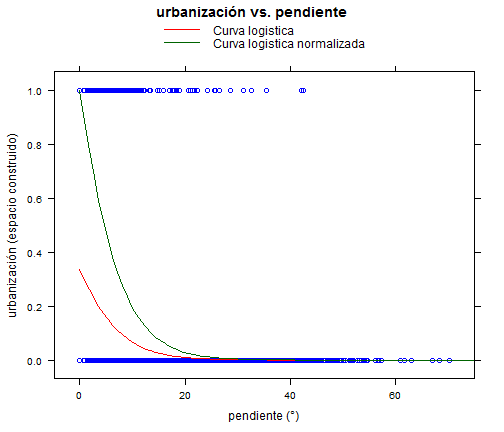

## Histogramas y subtotales por clase
========================================================

### Script para visualización de las histogramas y calculo de las estadisticas descriptivas por clase de la variable categorica.


By Viacheslav Shalisko 2015

This is free and unencumbered software released into the public domain.
Anyone is free to copy, modify, publish, use, compile, sell, or
distribute this software, either in source code form or as a compiled
binary, for any purpose, commercial or non-commercial, and by any
means.
In jurisdictions that recognize copyright laws, the author or authors
of this software dedicate any and all copyright interest in the
software to the public domain. We make this dedication for the benefit
of the public at large and to the detriment of our heirs and
successors. We intend this dedication to be an overt act of
relinquishment in perpetuity of all present and future rights to this
software under copyright law.
THE SOFTWARE IS PROVIDED "AS IS", WITHOUT WARRANTY OF ANY KIND,
EXPRESS OR IMPLIED, INCLUDING BUT NOT LIMITED TO THE WARRANTIES OF
MERCHANTABILITY, FITNESS FOR A PARTICULAR PURPOSE AND NONINFRINGEMENT.
IN NO EVENT SHALL THE AUTHORS BE LIABLE FOR ANY CLAIM, DAMAGES OR
OTHER LIABILITY, WHETHER IN AN ACTION OF CONTRACT, TORT OR OTHERWISE,
ARISING FROM, OUT OF OR IN CONNECTION WITH THE SOFTWARE OR THE USE OR
OTHER DEALINGS IN THE SOFTWARE.
For more information, please refer to <http://unlicense.org>


### 1) Definir las variables

*my_path* - ruta a carpeta con la ubicación de las tablas fuente y de salida

*my_filename* - nombre de tabla fune en el formato DBF

*my_out_statistics_table* - nombre del archivo de tabla para almacenar estadistica por clase en el formato CSV (esta tabla se reescribe cada vez que se ejecuta el script)

*my_out_statistics_table* - nombre del archivo de tabla para almacenar valeres de frecuencias en histogramas por clase en el formato CSV (esta tabla se reescribe cada vez que se ejecuta el script)

*my_category_field* - columna de tabla con variable categorica que determina clases

*my_interest_field* - columna de tabla con variable cuantitativa a anlizar

*my_breaks* - los valores de separación de rangos en histograma de variable cuantitativa; es importante que los valores minimo y maximo de los rangos deben encontrarse fuera de rango de los valores observados de la variable cuantitativa; el límite inferior de variables debe ser mayor que 0, ya que la representación logaritmica no permite tener valor 0 o negativo de rangos; ejemplo: 1e-10,0.1,1,5,10,20,30

*my_title* - titulo común para histogramas


```r
# Definir variables aqui:

my_path <- "C:\\Users\\Viacheslav\\Documents\\Projects_GIS\\IMEPLAN\\Pruebas_con_metadatos"
my_filename <- 'cuadrados1ha_industrias_SJ_municipios.dbf'
my_out_statistics_table <- 'cuadrados1ha_industrias_SJ_municipios_statistics.csv'
my_out_histogram_table <- 'cuadrados1ha_industrias_SJ_municipios_histogramas.csv'

my_category_field = "CVE_MUN"
my_interest_field = "industr_ha"

my_breaks <- c(1e-10,0.1,1,5,10,20,30)
my_title = "industrias por ha"
```

### 2) Cargar los datos fuente


```r
library(foreign)
my_data <- read.dbf(file.path(my_path, my_filename))
```

### 3) Representar dimension y sumatorios de los datos fuentes
(paso requerido para control de los datos fuentes)


```r
my_table <- data.frame(t(rep(NA,10)))
columns <- c("CVE_MUN", "N.OBS.", "PROMEDIO", "SUMA", "DESV.EST.", "MINIMO", "QUARTIL1", "MEDIANA", "QUARTIL3", "MAXIMO")
names(my_table) <- columns

my_count <- function(x, ...){
  x <- x[!is.na(x)]
  n <- length(x)
  return(c(n=n))
}

category_field_values <- unique(my_data[,my_category_field], incomparables = FALSE)
dim(my_data)
```

```
## [1] 68987     6
```

```r
summary(my_data)
```

```
##    Join_Count   TARGET_FID       Area_ha     FID_copy    
##  Min.   :1    Min.   :    0   Min.   :1   Min.   :    0  
##  1st Qu.:1    1st Qu.:17247   1st Qu.:1   1st Qu.:17247  
##  Median :1    Median :34493   Median :1   Median :34493  
##  Mean   :1    Mean   :34493   Mean   :1   Mean   :34493  
##  3rd Qu.:1    3rd Qu.:51740   3rd Qu.:1   3rd Qu.:51740  
##  Max.   :1    Max.   :68986   Max.   :1   Max.   :68986  
##                                                          
##    industr_ha          CVE_MUN     
##  Min.   : 0.00000   120    :21679  
##  1st Qu.: 0.00000   039    :14400  
##  Median : 0.01906   097    :10758  
##  Mean   : 0.30237   098    : 8728  
##  3rd Qu.: 0.33251   101    : 7223  
##  Max.   :23.59860   070    : 3901  
##                     (Other): 2298
```

```r
my_quantile_total <- as.vector(quantile(my_data[[my_interest_field]],na.rm = TRUE))

my_table_line <- c("Total", my_count(my_data[[my_interest_field]]), 
                        mean(my_data[[my_interest_field]],na.rm = TRUE), 
                        sum(my_data[[my_interest_field]],na.rm = TRUE), 
                        sd(my_data[[my_interest_field]],na.rm = TRUE), 
                        my_quantile_total[1],my_quantile_total[2],my_quantile_total[3],
                        my_quantile_total[4],my_quantile_total[5])

my_table <- rbind(my_table,my_table_line)
my_table <- my_table[-1,]
my_table
```

```
##   CVE_MUN N.OBS.          PROMEDIO            SUMA         DESV.EST.
## 2   Total  68987 0.302372900762766 20859.799304921 0.639757112882348
##   MINIMO QUARTIL1   MEDIANA  QUARTIL3  MAXIMO
## 2      0        0 0.0190629 0.3325065 23.5986
```

Lista de valores de variable categorica: 044, 030, 097, 051, 070, 083, 098, 101, 124, 120, 039, 009;

### 4) Calcular las estadisticas por variable categorica y guardar tabla en forma del archivo CSV


```r
my_mean <- aggregate(my_data[[my_interest_field]], list(categories = my_data[[my_category_field]]), 
           FUN = mean, na.rm = TRUE)
my_sum <- aggregate(my_data[[my_interest_field]], list(my_data[[my_category_field]]), 
           FUN = sum, na.rm = TRUE)
my_sd <- aggregate(my_data[[my_interest_field]], list(my_data[[my_category_field]]), 
           FUN = sd, na.rm = TRUE)
my_nobs <- aggregate(my_data[[my_interest_field]], list(my_data[[my_category_field]]), 
           FUN = my_count)
my_quantile <- aggregate(my_data[[my_interest_field]], list(my_data[[my_category_field]]), 
           FUN = quantile, na.rm = TRUE)

my_table_subtotal <- cbind(my_mean[1], my_nobs$x, my_mean$x, my_sum$x, my_sd$x, my_quantile$x)
names(my_table_subtotal)<-columns
my_table <- rbind(my_table,my_table_subtotal)

my_table[, 2:10] <- lapply(my_table[, 2:10], as.numeric) 
my_table
```

```
##    CVE_MUN N.OBS.   PROMEDIO        SUMA DESV.EST. MINIMO  QUARTIL1
## 2    Total  68987 0.30237290 20859.79930 0.6397571      0 0.0000000
## 21     009     80 0.00000000     0.00000 0.0000000      0 0.0000000
## 3      030    355 0.00000000     0.00000 0.0000000      0 0.0000000
## 4      039  14400 0.69916932 10068.03814 0.9745965      0 0.0244481
## 5      044   1298 0.07163537    92.98271 0.2772099      0 0.0000000
## 6      051    401 0.08961125    35.93411 0.2155211      0 0.0000000
## 7      070   3901 0.14149592   551.97560 0.2883707      0 0.0000000
## 8      083     38 0.00000000     0.00000 0.0000000      0 0.0000000
## 9      097  10758 0.07716012   830.08861 0.2259689      0 0.0000000
## 10     098   8728 0.26655553  2326.49666 0.4638227      0 0.0000000
## 11     101   7223 0.37723057  2724.73643 0.7678901      0 0.0000000
## 12     120  21679 0.19509881  4229.54705 0.4334953      0 0.0000000
## 13     124    126 0.00000000     0.00000 0.0000000      0 0.0000000
##       MEDIANA   QUARTIL3   MAXIMO
## 2  0.01906290 0.33250650 23.59860
## 21 0.00000000 0.00000000  0.00000
## 3  0.00000000 0.00000000  0.00000
## 4  0.39312700 1.02132750 23.59860
## 5  0.00000000 0.00000000  3.78337
## 6  0.00000000 0.06545400  1.56392
## 7  0.00929756 0.14082100  3.56588
## 8  0.00000000 0.00000000  0.00000
## 9  0.00000000 0.02714525  4.78288
## 10 0.04706360 0.33399400  4.53116
## 11 0.06816040 0.41675800 13.16790
## 12 0.00000000 0.17339700 13.54240
## 13 0.00000000 0.00000000  0.00000
```

```r
write.table(my_table, file = file.path(my_path, my_out_statistics_table), sep = ",", row.names = FALSE)
```

### 4) Visualizar histogramas de la columna de interes en todo conjunto de datos


```r
par(mfcol = c(1, 2))
H0 <- hist(my_data[,my_interest_field], prob=FALSE, 
          col="grey", main=my_title, breaks=my_breaks, 
          xlab="densidad", ylab="observaciones") 
```

```
## Warning in plot.histogram(r, freq = freq1, col = col, border = border,
## angle = angle, : the AREAS in the plot are wrong -- rather use 'freq =
## FALSE'
```

```r
HA <- hist(log10(my_data[,my_interest_field]), prob=FALSE, 
          col="grey", breaks=log10(my_breaks), 
          axes = FALSE, main=my_title,
          xlab="densidad", ylab="observaciones") 
```

```
## Warning in plot.histogram(r, freq = freq1, col = col, border = border,
## angle = angle, : the AREAS in the plot are wrong -- rather use 'freq =
## FALSE'
```

```r
Axis(side = 2)
Axis(at = HA$breaks, labels = 10^HA$breaks, side = 1)
```

 

```r
HA$counts
```

```
## [1] 12158 19702  6575    67    17     2
```

```r
my_hist_table <- data.frame(t(rep(NA,length(my_breaks))))
names(my_hist_table) <- c("CVE_MUN",my_breaks[1:length(my_breaks)-1])

my_hist_table = rbind(my_hist_table, c(toString("Total"), HA$counts))
```

### 5) Visualizar histogramas de la columna de interes por clase y almacenar los valores de frecuencias por rango por clase


```r
for (i in 1:length(category_field_values) ) {
  print_text <- paste("Histograma para clase:",category_field_values[i], sep = " ")
  print(print_text)
  par(cex = 0.8)
    HB <- hist(my_data[my_data[[my_category_field]] == category_field_values[i], my_interest_field], 
            prob=FALSE, col="grey", breaks = my_breaks, labels = TRUE,
            main=paste(my_title,"-",category_field_values[i], sep = " "),
            xlab="densidad", ylab="observaciones") 
  
  my_hist_table = rbind(my_hist_table, c(toString(category_field_values[i]), HB$counts))
}
```

```
## [1] "Histograma para clase: 044"
```

 

```
## [1] "Histograma para clase: 030"
```

 

```
## [1] "Histograma para clase: 097"
```

 

```
## [1] "Histograma para clase: 051"
```

 

```
## [1] "Histograma para clase: 070"
```

 

```
## [1] "Histograma para clase: 083"
```

 

```
## [1] "Histograma para clase: 098"
```

 

```
## [1] "Histograma para clase: 101"
```

 

```
## [1] "Histograma para clase: 124"
```

 

```
## [1] "Histograma para clase: 120"
```

 

```
## [1] "Histograma para clase: 039"
```

 

```
## [1] "Histograma para clase: 009"
```

 

### 6) Representar la tabla de frecuencias por clase en rangos de histograma y guardar en forma del archivo CSV


```r
my_hist_table = my_hist_table[-1,]
dim(my_hist_table)
```

```
## [1] 13  7
```

```r
my_hist_table[, 2:length(my_breaks)] <- lapply(my_hist_table[, 2:length(my_breaks)], as.numeric) 
my_hist_table
```

```
##    CVE_MUN 1e-10   0.1    1  5 10 20
## 2    Total 12158 19702 6575 67 17  2
## 3      044  1146   126   26  0  0  0
## 4      030   355     0    0  0  0  0
## 5      097  8976  1637  145  0  0  0
## 6      051   320    77    4  0  0  0
## 7      070  2716  1090   95  0  0  0
## 8      083    38     0    0  0  0  0
## 9      098  4963  3127  638  0  0  0
## 10     101  3950  2432  819 19  3  0
## 11     124   126     0    0  0  0  0
## 12     120 15162  5308 1208  0  1  0
## 13     039  4792  5905 3640 48 13  2
## 14     009    80     0    0  0  0  0
```

```r
write.table(my_hist_table, file = file.path(my_path, my_out_histogram_table), sep = ",", row.names = FALSE)
```


