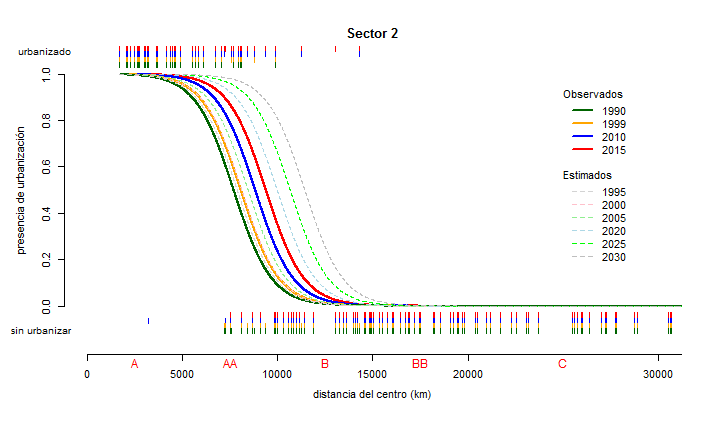

```r
my_path <- "C:\\Users\\Viacheslav\\Google Drive\\Projects_actual\\geo_Urbanismo_IMEPLAN\\IMEPLAN_t4"
my_filename <- 'Random_points_sectors_25.csv'
my_breaks <- c(0,5000,10000,15000,20000,30000,40000,50000)
my_labels <- c("A","AA","B","BB","C","D","E")
my_labels_position <- c(2500,7500,12500,17500,25000,35000,45000)
my_years <- c(1995,2000,2005,2020,2025,2030)
observation_years <- c(1990,1999,2010,2015)
sequence_years <- c(1990,1995,2000,2005,2010,2015,2020,2025,2030)
sequence_years_lwd <- c(3,2,3,2,3,3,2,2,2)
observation_colors <- c("darkgreen","orange","blue","red")
sequence_colors <- c("lightgray","pink","lightgreen","lightblue","green","gray")
sequence2_colors <- c("darkgreen","lightgray","orange","lightgreen","blue","red","lightblue","green","gray")
thresh  <- 0.5
slope <- 0.001
logistic_function <- function(P0_x,A,I) {
  1 - (1 / (1 + exp( -A * P0_x + I )))
}


my_data <- read.csv(file.path(my_path, my_filename))
dim(my_data)
```

```
## [1] 1400   10
```

```r
summary(my_data)
```

```
##       CID        Clave        Sector       Clave_comp      FID_copy     
##  Min.   : 0.00   A :200   Min.   :1.00   A1     :  25   Min.   :   0.0  
##  1st Qu.:13.75   AA:200   1st Qu.:2.75   A2     :  25   1st Qu.: 349.8  
##  Median :27.50   B :200   Median :4.50   A3     :  25   Median : 699.5  
##  Mean   :27.50   BB:200   Mean   :4.50   A4     :  25   Mean   : 699.5  
##  3rd Qu.:41.25   C :200   3rd Qu.:6.25   A5     :  25   3rd Qu.:1049.2  
##  Max.   :55.00   D :200   Max.   :8.00   A6     :  25   Max.   :1399.0  
##                  E :200                  (Other):1250                   
##     Distance           u2015            u2010            u1999       
##  Min.   :  412.5   Min.   :0.0000   Min.   :0.0000   Min.   :0.0000  
##  1st Qu.: 9066.6   1st Qu.:0.0000   1st Qu.:0.0000   1st Qu.:0.0000  
##  Median :17761.5   Median :0.0000   Median :0.0000   Median :0.0000  
##  Mean   :20962.5   Mean   :0.3493   Mean   :0.3386   Mean   :0.2857  
##  3rd Qu.:32863.7   3rd Qu.:1.0000   3rd Qu.:1.0000   3rd Qu.:1.0000  
##  Max.   :49991.0   Max.   :1.0000   Max.   :1.0000   Max.   :1.0000  
##                                                                      
##      u1990      
##  Min.   :0.000  
##  1st Qu.:0.000  
##  Median :0.000  
##  Mean   :0.245  
##  3rd Qu.:0.000  
##  Max.   :1.000  
## 
```


### Graficas de desplazamiento de limite de la ciudad por sector


```r
as.numeric.factor <- function(x) {as.numeric(levels(x))[x]}

growth_frame <- data.frame(years=sequence_years)

for (i in 1:8) {

par(mfcol = c(1, 1), cex = 0.9, mar = c(9,5,5,3))
  
P0_x <- my_data[my_data["Sector"]==i,"Distance"]
P0_y2015 <- my_data[my_data["Sector"]==i,"u2015"]
P0_y2010 <- my_data[my_data["Sector"]==i,"u2010"]
P0_y1999 <- my_data[my_data["Sector"]==i,"u1999"]
P0_y1990 <- my_data[my_data["Sector"]==i,"u1990"]

P0_y2015 <- P0_y2015 | P0_y2010 | P0_y1999 | P0_y1990    # esnure increment only

P0_fit2015 <- glm(P0_y2015 ~ offset(-slope * P0_x),
               family=binomial(logit))
P0_fit2010 <- glm(P0_y2010 ~ offset(-slope * P0_x),
               family=binomial(logit))
P0_fit1999 <- glm(P0_y1999 ~ offset(-slope * P0_x),
               family=binomial(logit))
P0_fit1990 <- glm(P0_y1990 ~ offset(-slope * P0_x),
               family=binomial(logit))

#print(summary(P0_fit2015))
#print(summary(P0_fit2010))
#print(summary(P0_fit1999))
#print(summary(P0_fit1990))

sequence <- data.frame(P0_x=seq(from=min(P0_x), to=max(P0_x), by=5))
my_response2015 <- predict(P0_fit2015, newdata=sequence, type="response", se.fit=TRUE)
my_response2010 <- predict(P0_fit2010, newdata=sequence, type="response", se.fit=TRUE)
my_response1999 <- predict(P0_fit1999, newdata=sequence, type="response", se.fit=TRUE)
my_response1990 <- predict(P0_fit1990, newdata=sequence, type="response", se.fit=TRUE)

plot(P0_x, P0_y2015, col='red',
     xlim=c(0,30000), ylim= c(0,1),
            xlab="", ylab="", 
            main = paste("Sector", i, sep = " "), axes = FALSE, pch = NA)

axis(side=2)
axis(side=1, line=3, at=my_breaks, labels=my_breaks)
mtext(my_labels, side=1, at=my_labels_position, line = 3.2, col= "red")
title(xlab = "distancia del centro (km)", line = 5.5)
title(ylab = "presencia de urbanización", line = 3)
mtext(c("sin urbanizar","urbanizado"), side=2, at=c(-0.1,1.1), line = -0.5, cex = 0.8, las = 1)

text(25000, y=0.9, label="Observados", adj = c(0,0))
legend(25000, y=0.9, 
       observation_years, 
       col = observation_colors,
       lty=1,lwd=2,ncol=1,box.lty=0)

text(25000, y=0.55, label="Estimados", adj = c(0,0))
legend(25000, y=0.55, 
       my_years, 
       col = sequence_colors,
       lty=2,lwd=1,ncol=1,box.lty=0)

lines(sequence$P0_x , my_response2015$fit, lwd = 2 , col = observation_colors[4])
lines(sequence$P0_x , my_response2010$fit, lwd = 2 , col = observation_colors[3])
lines(sequence$P0_x , my_response1999$fit, lwd = 2 , col = observation_colors[2])
lines(sequence$P0_x , my_response1990$fit, lwd = 2 , col = observation_colors[1])

rug(P0_x[P0_y2015 == 0], side = 1, ticksize = 0.02, col= observation_colors[4], line=0.2)
rug(P0_x[P0_y2015 == 1], side = 3, ticksize = 0.02, col= observation_colors[4], line=1.4)
rug(P0_x[P0_y2010 == 0], side = 1, ticksize = 0.02, col= observation_colors[3], line=0.6)
rug(P0_x[P0_y2010 == 1], side = 3, ticksize = 0.02, col= observation_colors[3], line=1.0)
rug(P0_x[P0_y1999 == 0], side = 1, ticksize = 0.02, col= observation_colors[2], line=1.0)
rug(P0_x[P0_y1999 == 1], side = 3, ticksize = 0.02, col= observation_colors[2], line=0.6)
rug(P0_x[P0_y1990 == 0], side = 1, ticksize = 0.02, col= observation_colors[1], line=1.4)
rug(P0_x[P0_y1990 == 1], side = 3, ticksize = 0.02, col= observation_colors[1], line=0.2)

# Predicting growth

limit <- c(           
           P0_fit1990$coefficients / slope,
           P0_fit1999$coefficients / slope,
           P0_fit2010$coefficients / slope,
           P0_fit2015$coefficients / slope
           )

date <- observation_years
date2 <- observation_years^2
growth_fit <- lm(limit ~ date + date2)

if(growth_fit$coefficients["date2"] < 0) {
  # use linear model instead if there are negative cuadratic member of polynomic
  growth_fit <- glm(limit ~ date)
}

#print(summary(growth_fit))
my_years_sequence <- data.frame(date=my_years,date2=my_years^2)
growth_predict <- predict(growth_fit, newdata=my_years_sequence, type="response", se.fit=TRUE)

lines(sequence$P0_x , logistic_function(sequence$P0_x,slope,growth_predict$fit[1]*slope), lty=2, lwd = 1 , col = sequence_colors[1])
lines(sequence$P0_x , logistic_function(sequence$P0_x,slope,growth_predict$fit[2]*slope), lty=2, lwd = 1 , col = sequence_colors[2])
lines(sequence$P0_x , logistic_function(sequence$P0_x,slope,growth_predict$fit[3]*slope), lty=2, lwd = 1 , col = sequence_colors[3])
lines(sequence$P0_x , logistic_function(sequence$P0_x,slope,growth_predict$fit[4]*slope), lty=2, lwd = 1 , col = sequence_colors[4])
lines(sequence$P0_x , logistic_function(sequence$P0_x,slope,growth_predict$fit[5]*slope), lty=2, lwd = 1 , col = sequence_colors[5])
lines(sequence$P0_x , logistic_function(sequence$P0_x,slope,growth_predict$fit[6]*slope), lty=2, lwd = 1 , col = sequence_colors[6])

# Output values

print("Observados");
print(paste("Limite observado en 1990: ",format(P0_fit1990$coefficients / slope,digits=5)," km"))
print(paste("Limite observado en 1999: ",format(P0_fit1999$coefficients / slope,digits=5)," km"))
print(paste("Limite observado en 2010: ",format(P0_fit2010$coefficients / slope,digits=5)," km"))
print(paste("Limite observado en 2015: ",format(P0_fit2015$coefficients / slope,digits=5)," km"))

print("Estimados");
print(paste("Limite predición en 1995: ",format(growth_predict$fit[1],digits=5)," km"))
print(paste("Limite predición en 2000: ",format(growth_predict$fit[2],digits=5)," km"))
print(paste("Limite predición en 2005: ",format(growth_predict$fit[3],digits=5)," km"))
print(paste("Limite predición en 2020: ",format(growth_predict$fit[4],digits=5)," km"))
print(paste("Limite predición en 2025: ",format(growth_predict$fit[5],digits=5)," km"))
print(paste("Limite predición en 2030: ",format(growth_predict$fit[6],digits=5)," km"))

growth_frame <- cbind(growth_frame,c(P0_fit1990$coefficients/slope,
                                     growth_predict$fit[1:3],
                                     P0_fit2010$coefficients/slope,
                                     P0_fit2015$coefficients/slope,
                                     growth_predict$fit[4:6]))

}
```

 

```
## [1] "Observados"
## [1] "Limite observado en 1990:  7023.3  km"
## [1] "Limite observado en 1999:  8381.1  km"
## [1] "Limite observado en 2010:  8991.9  km"
## [1] "Limite observado en 2015:  9197.8  km"
## [1] "Estimados"
## [1] "Limite predición en 1995:  7684  km"
## [1] "Limite predición en 2000:  8104.3  km"
## [1] "Limite predición en 2005:  8524.6  km"
## [1] "Limite predición en 2020:  9785.6  km"
## [1] "Limite predición en 2025:  10206  km"
## [1] "Limite predición en 2030:  10626  km"
```

 

```
## [1] "Observados"
## [1] "Limite observado en 1990:  7694  km"
## [1] "Limite observado en 1999:  8073.6  km"
## [1] "Limite observado en 2010:  8824.1  km"
## [1] "Limite observado en 2015:  9387.2  km"
## [1] "Estimados"
## [1] "Limite predición en 1995:  7860  km"
## [1] "Limite predición en 2000:  8105.3  km"
## [1] "Limite predición en 2005:  8438.4  km"
## [1] "Limite predición en 2020:  9964.3  km"
## [1] "Limite predición en 2025:  10649  km"
## [1] "Limite predición en 2030:  11421  km"
```

 

```
## [1] "Observados"
## [1] "Limite observado en 1990:  9186.8  km"
## [1] "Limite observado en 1999:  10421  km"
## [1] "Limite observado en 2010:  13981  km"
## [1] "Limite observado en 2015:  15669  km"
## [1] "Estimados"
## [1] "Limite predición en 1995:  9794  km"
## [1] "Limite predición en 2000:  10786  km"
## [1] "Limite predición en 2005:  12115  km"
## [1] "Limite predición en 2020:  18116  km"
## [1] "Limite predición en 2025:  20789  km"
## [1] "Limite predición en 2030:  23797  km"
```

 

```
## [1] "Observados"
## [1] "Limite observado en 1990:  9488.8  km"
## [1] "Limite observado en 1999:  12236  km"
## [1] "Limite observado en 2010:  14288  km"
## [1] "Limite observado en 2015:  17244  km"
## [1] "Estimados"
## [1] "Limite predición en 1995:  10735  km"
## [1] "Limite predición en 2000:  11983  km"
## [1] "Limite predición en 2005:  13416  km"
## [1] "Limite predición en 2020:  18820  km"
## [1] "Limite predición en 2025:  20989  km"
## [1] "Limite predición en 2030:  23343  km"
```

 

```
## [1] "Observados"
## [1] "Limite observado en 1990:  10386  km"
## [1] "Limite observado en 1999:  11717  km"
## [1] "Limite observado en 2010:  13522  km"
## [1] "Limite observado en 2015:  16701  km"
## [1] "Estimados"
## [1] "Limite predición en 1995:  10743  km"
## [1] "Limite predición en 2000:  11415  km"
## [1] "Limite predición en 2005:  12569  km"
## [1] "Limite predición en 2020:  18927  km"
## [1] "Limite predición en 2025:  22011  km"
## [1] "Limite predición en 2030:  25577  km"
```

 

```
## [1] "Observados"
## [1] "Limite observado en 1990:  10956  km"
## [1] "Limite observado en 1999:  11942  km"
## [1] "Limite observado en 2010:  13979  km"
## [1] "Limite observado en 2015:  15198  km"
## [1] "Estimados"
## [1] "Limite predición en 1995:  11430  km"
## [1] "Limite predición en 2000:  12091  km"
## [1] "Limite predición en 2005:  12940  km"
## [1] "Limite predición en 2020:  16611  km"
## [1] "Limite predición en 2025:  18208  km"
## [1] "Limite predición en 2030:  19994  km"
```

 

```
## [1] "Observados"
## [1] "Limite observado en 1990:  7931.5  km"
## [1] "Limite observado en 1999:  9845.9  km"
## [1] "Limite observado en 2010:  11807  km"
## [1] "Limite observado en 2015:  13552  km"
## [1] "Estimados"
## [1] "Limite predición en 1995:  8871.1  km"
## [1] "Limite predición en 2000:  9843.4  km"
## [1] "Limite predición en 2005:  10920  km"
## [1] "Limite predición en 2020:  14781  km"
## [1] "Limite predición en 2025:  16277  km"
## [1] "Limite predición en 2030:  17878  km"
```

 

```
## [1] "Observados"
## [1] "Limite observado en 1990:  8048.1  km"
## [1] "Limite observado en 1999:  9676.8  km"
## [1] "Limite observado en 2010:  11247  km"
## [1] "Limite observado en 2015:  13028  km"
## [1] "Estimados"
## [1] "Limite predición en 1995:  8796.4  km"
## [1] "Limite predición en 2000:  9595.1  km"
## [1] "Limite predición en 2005:  10533  km"
## [1] "Limite predición en 2020:  14185  km"
## [1] "Limite predición en 2025:  15681  km"
## [1] "Limite predición en 2030:  17316  km"
```


### Diagramas de "rosa"


```r
colnames(growth_frame) <- c("year","S1","S2","S3","S4","S5","S6","S7","S8")
growth_frame
```

```
##   year        S1        S2        S3        S4       S5       S6        S7
## 1 1990  7023.259  7693.977  9186.768  9488.787 10386.06 10955.97  7931.451
## 2 1995  7683.958  7860.027  9793.994 10735.014 10742.81 11429.78  8871.142
## 3 2000  8104.287  8105.291 10786.472 11983.408 11414.76 12091.47  9843.369
## 4 2005  8524.616  8438.351 12114.942 13416.068 12569.13 12940.39 10920.424
## 5 2010  8991.880  8824.100 13980.920 14288.046 13521.79 13979.18 11806.564
## 6 2015  9197.798  9387.172 15669.028 17243.909 16701.43 15198.49 13551.678
## 7 2020  9785.603  9964.313 18116.309 18819.646 18926.81 16610.57 14780.559
## 8 2025 10205.932 10648.560 20788.750 20989.372 22010.89 18208.43 16276.928
## 9 2030 10626.261 11420.604 23797.183 23343.363 25577.40 19993.53 17878.125
##          S8
## 1  8048.125
## 2  8796.354
## 3  9595.127
## 4 10533.344
## 5 11247.330
## 6 13028.130
## 7 14184.657
## 8 15680.648
## 9 17316.083
```

```r
#stars(growth_frame[,2:9], draw.segments = FALSE, 
#      scale=FALSE, radius=FALSE, locations = c(0,0),
#      main = "Crecimeinto de límite de la ciudad",
#      col.lines = c("darkgreen","lightgray","pink","lightgreen",
#                    "blue","red","lightblue","green","gray"),
#      key.labels = c("S1","S2","S3","S4","S5","S6","S7","S8"),
#      key.loc = c(0,0)
#      )

require(plotrix)
```

```
## Loading required package: plotrix
```

```r
par(cex.lab= 0.8 )
PP <- polar.plot(growth_frame[9,2:9],
             polar.pos=c(0,45,90,135,180,225,270,315)+22.5,
           labels = c("","","","","","","",""),
           label.pos=c(0,45,90,135,180,225,270,315),
           radial.lim = c(0,max(growth_frame[9,2:9])),
           start=90,clockwise=TRUE,rp.type="s",
           point.symbols = NA, show.grid.labels=3,grid.col = "lightgray")

for (j in 1:9) {
  
  y <- c(as.numeric(growth_frame[j,2:9]))
  x <- c(0,45,90,135,180,225,270,315)+22.5
  
  polar.plot(y,
             polar.pos=x,
             radial.lim = c(0,max(growth_frame[j,2:9])),
           start=90,clockwise=TRUE,rp.type="p",
           lwd=sequence_years_lwd[j],line.col=sequence2_colors[j],add=TRUE)
  
}

text(25000, y=34000, label="Observados", adj = c(0,0))
legend(25000, y=34000, 
       observation_years, 
       col = observation_colors,
       lty=1,lwd=3,ncol=1,box.lty=0)

text(25000, y=26000, label="Estimados", adj = c(0,0))
legend(25000, y=26000, 
       my_years[c(1,3:6)], 
       col = sequence_colors[c(1,3:6)],
       lty=1,lwd=2,ncol=1,box.lty=0)
text(12300,y=25000,label="S1",col="red")
text(-12300,y=25000,label="S8",col="red")
text(12300,y=-25000,label="S4",col="red")
text(-12300,y=-25000,label="S5",col="red")
text(25000,y=12200,label="S2",col="red")
text(25000,y=-12200,label="S3",col="red")
text(-25000,y=-12200,label="S6",col="red")
text(-25000,y=12200,label="S7",col="red")
```

 

### Diagramas de "rosa" suavizada


```r
require(plotrix)
require(mgcv)
```

```
## Loading required package: mgcv
## Loading required package: nlme
## This is mgcv 1.8-0. For overview type 'help("mgcv-package")'.
```

```r
par(cex.lab= 0.8 )
PP <- polar.plot(growth_frame[9,2:9],
             polar.pos=c(0,45,90,135,180,225,270,315)+22.5,
           labels = c("","","","","","","",""),
           label.pos=c(0,45,90,135,180,225,270,315),
           radial.lim = c(0,max(growth_frame[9,2:9])),
           start=90,clockwise=TRUE,rp.type="s",
           lwd=2,line.col="red",show.grid.labels=3)
for (j in 1:9) {
  y <- c(as.numeric(growth_frame[j,2:9]),as.numeric(growth_frame[j,2:7]))
  x <- c(0,45,90,135,180,225,270,315,360,405,450,495,540,585)+22.5
  
#  polar.plot(y,
#             polar.pos=x,
#             radial.lim = c(0,max(growth_frame[9,2:9])),
#           start=90,clockwise=TRUE,rp.type="p",
#           lwd=1,line.col=j,add=TRUE)
  
  polar_sequence <- data.frame(x=seq(from=90, to=450, by=1))
  my_polar_fit <- gam(y ~ s(x, k=13, fx = TRUE, bs="tp"))
  my_predicted_y <- predict(my_polar_fit,newdata=polar_sequence, type="response", se.fit=TRUE)
  
  print(summary(my_polar_fit))
  
    polar.plot(as.numeric(my_predicted_y$fit),
             polar.pos=polar_sequence$x,
             radial.lim = c(0,max(growth_frame[9,2:9])),
           start=90,clockwise=TRUE,rp.type="p",
           lwd=sequence_years_lwd[j],line.col=sequence2_colors[j],add=TRUE)
  
}
```

```
## 
## Family: gaussian 
## Link function: identity 
## 
## Formula:
## y ~ s(x, k = 13, fx = TRUE, bs = "tp")
## 
## Parametric coefficients:
##             Estimate Std. Error t value Pr(>|t|)  
## (Intercept)   8960.7      157.4   56.94   0.0112 *
## ---
## Signif. codes:  0 '***' 0.001 '**' 0.01 '*' 0.05 '.' 0.1 ' ' 1
## 
## Approximate significance of smooth terms:
##      edf Ref.df     F p-value
## s(x)  12     12 5.995    0.31
## 
## R-sq.(adj) =  0.822   Deviance explained = 98.6%
## GCV = 4.8548e+06  Scale est. = 3.4677e+05  n = 14
## 
## Family: gaussian 
## Link function: identity 
## 
## Formula:
## y ~ s(x, k = 13, fx = TRUE, bs = "tp")
## 
## Parametric coefficients:
##             Estimate Std. Error t value Pr(>|t|)  
## (Intercept)   9582.8      172.6   55.52   0.0115 *
## ---
## Signif. codes:  0 '***' 0.001 '**' 0.01 '*' 0.05 '.' 0.1 ' ' 1
## 
## Approximate significance of smooth terms:
##      edf Ref.df     F p-value
## s(x)  12     12 5.218   0.331
## 
## R-sq.(adj) =  0.796   Deviance explained = 98.4%
## GCV = 5.8387e+06  Scale est. = 4.1705e+05  n = 14
## 
## Family: gaussian 
## Link function: identity 
## 
## Formula:
## y ~ s(x, k = 13, fx = TRUE, bs = "tp")
## 
## Parametric coefficients:
##             Estimate Std. Error t value Pr(>|t|)  
## (Intercept)  10315.0      162.5   63.49     0.01 *
## ---
## Signif. codes:  0 '***' 0.001 '**' 0.01 '*' 0.05 '.' 0.1 ' ' 1
## 
## Approximate significance of smooth terms:
##      edf Ref.df     F p-value
## s(x)  12     12 7.814   0.273
## 
## R-sq.(adj) =  0.863   Deviance explained = 98.9%
## GCV = 5.174e+06  Scale est. = 3.6957e+05  n = 14
## 
## Family: gaussian 
## Link function: identity 
## 
## Formula:
## y ~ s(x, k = 13, fx = TRUE, bs = "tp")
## 
## Parametric coefficients:
##             Estimate Std. Error t value Pr(>|t|)   
## (Intercept)  11247.2      113.3   99.25  0.00641 **
## ---
## Signif. codes:  0 '***' 0.001 '**' 0.01 '*' 0.05 '.' 0.1 ' ' 1
## 
## Approximate significance of smooth terms:
##      edf Ref.df     F p-value
## s(x)  12     12 23.72   0.159
## 
## R-sq.(adj) =  0.954   Deviance explained = 99.6%
## GCV = 2.5172e+06  Scale est. = 1.798e+05  n = 14
## 
## Family: gaussian 
## Link function: identity 
## 
## Formula:
## y ~ s(x, k = 13, fx = TRUE, bs = "tp")
## 
## Parametric coefficients:
##             Estimate Std. Error t value Pr(>|t|)   
## (Intercept) 12158.98      26.37   461.1  0.00138 **
## ---
## Signif. codes:  0 '***' 0.001 '**' 0.01 '*' 0.05 '.' 0.1 ' ' 1
## 
## Approximate significance of smooth terms:
##      edf Ref.df     F p-value  
## s(x)  12     12 593.2  0.0321 *
## ---
## Signif. codes:  0 '***' 0.001 '**' 0.01 '*' 0.05 '.' 0.1 ' ' 1
## 
## R-sq.(adj) =  0.998   Deviance explained =  100%
## GCV = 1.3627e+05  Scale est. = 9733.8    n = 14
## 
## Family: gaussian 
## Link function: identity 
## 
## Formula:
## y ~ s(x, k = 13, fx = TRUE, bs = "tp")
## 
## Parametric coefficients:
##             Estimate Std. Error t value Pr(>|t|)   
## (Intercept) 13812.53      58.93   234.4  0.00272 **
## ---
## Signif. codes:  0 '***' 0.001 '**' 0.01 '*' 0.05 '.' 0.1 ' ' 1
## 
## Approximate significance of smooth terms:
##      edf Ref.df     F p-value  
## s(x)  12     12 228.6  0.0516 .
## ---
## Signif. codes:  0 '***' 0.001 '**' 0.01 '*' 0.05 '.' 0.1 ' ' 1
## 
## R-sq.(adj) =  0.995   Deviance explained =  100%
## GCV = 6.8066e+05  Scale est. = 48619     n = 14
## 
## Family: gaussian 
## Link function: identity 
## 
## Formula:
## y ~ s(x, k = 13, fx = TRUE, bs = "tp")
## 
## Parametric coefficients:
##             Estimate Std. Error t value Pr(>|t|)  
## (Intercept)  15243.7      268.3   56.82   0.0112 *
## ---
## Signif. codes:  0 '***' 0.001 '**' 0.01 '*' 0.05 '.' 0.1 ' ' 1
## 
## Approximate significance of smooth terms:
##      edf Ref.df    F p-value
## s(x)  12     12 15.6   0.196
## 
## R-sq.(adj) =  0.931   Deviance explained = 99.5%
## GCV = 1.4107e+07  Scale est. = 1.0077e+06  n = 14
## 
## Family: gaussian 
## Link function: identity 
## 
## Formula:
## y ~ s(x, k = 13, fx = TRUE, bs = "tp")
## 
## Parametric coefficients:
##             Estimate Std. Error t value Pr(>|t|)  
## (Intercept)  16975.8      473.5   35.85   0.0178 *
## ---
## Signif. codes:  0 '***' 0.001 '**' 0.01 '*' 0.05 '.' 0.1 ' ' 1
## 
## Approximate significance of smooth terms:
##      edf Ref.df     F p-value
## s(x)  12     12 7.586   0.277
## 
## R-sq.(adj) =  0.859   Deviance explained = 98.9%
## GCV = 4.3951e+07  Scale est. = 3.1394e+06  n = 14
## 
## Family: gaussian 
## Link function: identity 
## 
## Formula:
## y ~ s(x, k = 13, fx = TRUE, bs = "tp")
## 
## Parametric coefficients:
##             Estimate Std. Error t value Pr(>|t|)  
## (Intercept)  18907.9      717.8   26.34   0.0242 *
## ---
## Signif. codes:  0 '***' 0.001 '**' 0.01 '*' 0.05 '.' 0.1 ' ' 1
## 
## Approximate significance of smooth terms:
##      edf Ref.df   F p-value
## s(x)  12     12 4.9   0.341
## 
## R-sq.(adj) =  0.783   Deviance explained = 98.3%
## GCV = 1.0099e+08  Scale est. = 7.2138e+06  n = 14
```

```r
text(25000, y=34000, label="Observados", adj = c(0,0))
legend(25000, y=34000, 
       observation_years, 
       col = observation_colors,
       lty=1,lwd=3,ncol=1,box.lty=0)

text(25000, y=26000, label="Estimados", adj = c(0,0))
legend(25000, y=26000, 
       my_years[c(1,3:6)], 
       col = sequence_colors[c(1,3:6)],
       lty=1,lwd=2,ncol=1,box.lty=0)
text(12300,y=25000,label="S1",col="red")
text(-12300,y=25000,label="S8",col="red")
text(12300,y=-25000,label="S4",col="red")
text(-12300,y=-25000,label="S5",col="red")
text(25000,y=12200,label="S2",col="red")
text(25000,y=-12200,label="S3",col="red")
text(-25000,y=-12200,label="S6",col="red")
text(-25000,y=12200,label="S7",col="red")
```

 
